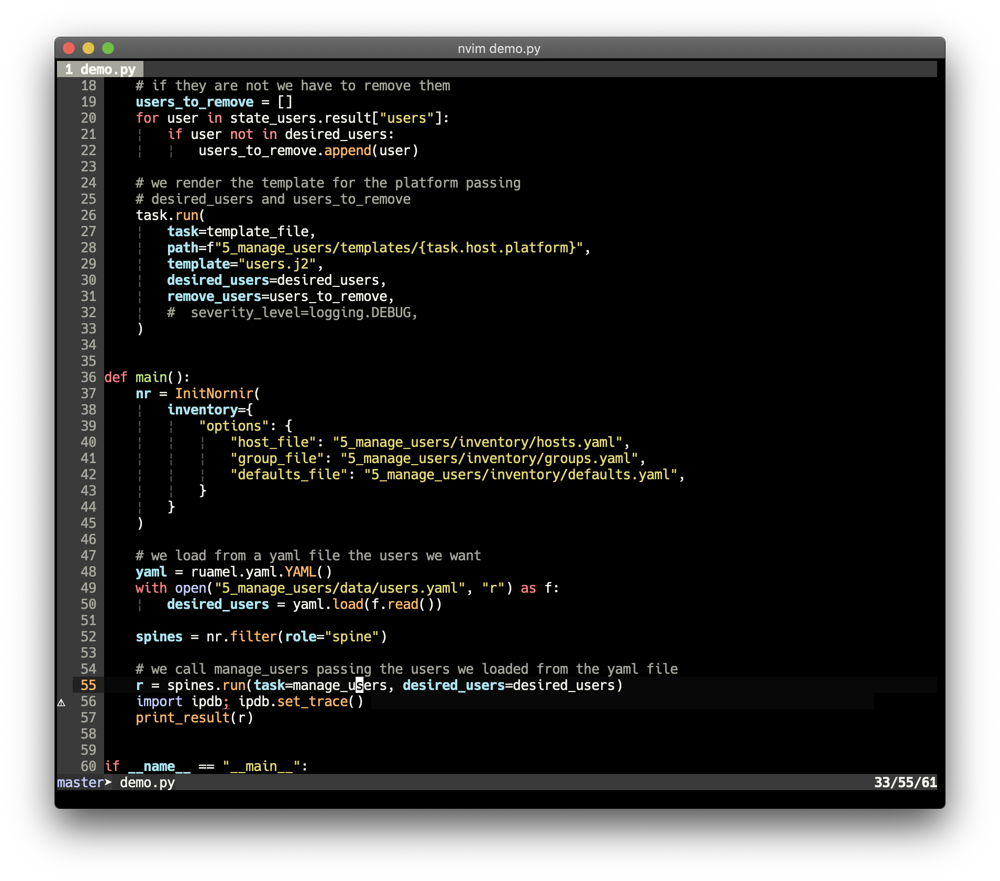
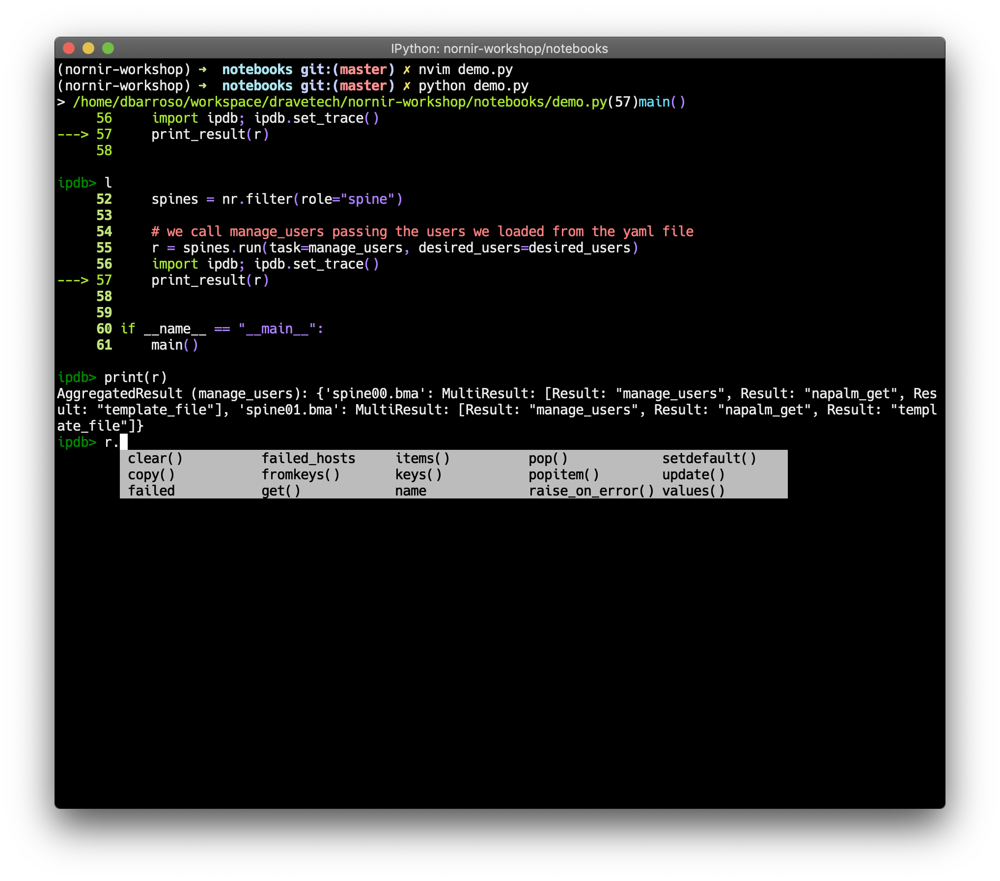
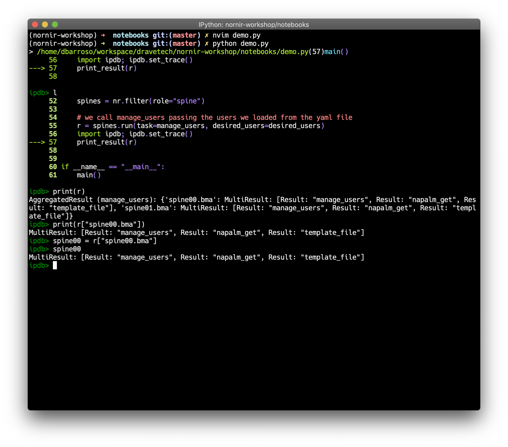
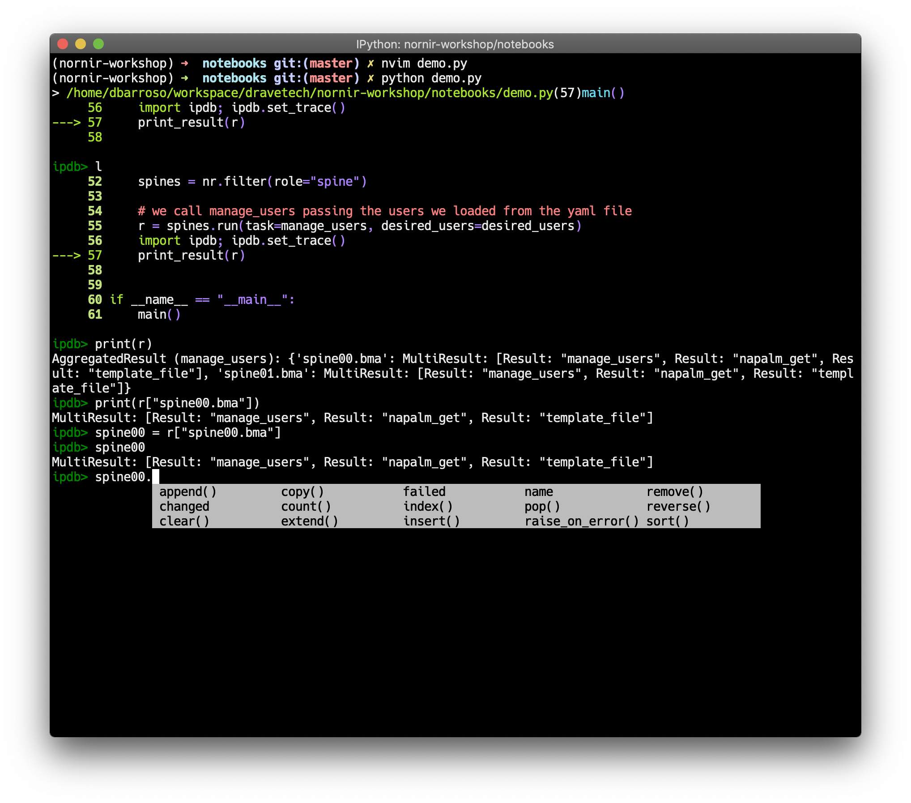
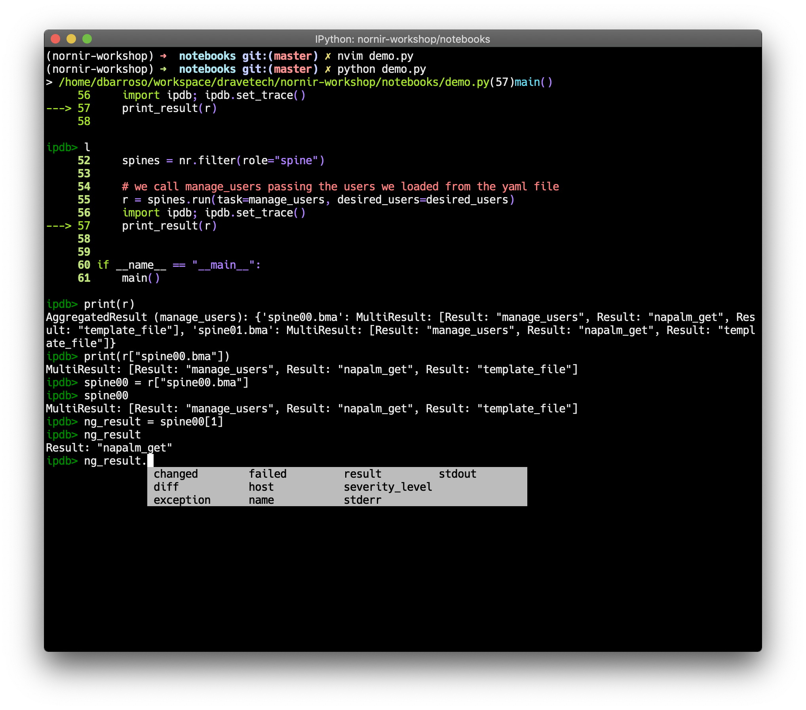

ipdb: How to inspect complex structures
=======================================

Python comes with a debuger called pdb. The python debugger is very powerful and really facilitates troubleshooting code. You can find the official documentation `here <https://docs.python.org/3/library/pdb.html>`_. `ipdb <https://github.com/gotcha/ipdb>`_ builds on top of ipython and pdb to give users a more interactive experience.

This how to isn't very extensive, it's just a very quick and dirty demo to show some of it's capabilities and how to use it with nornir. It doesn't assume previous knowledge but doesn't spend too much on explanations either so it expects users to give enough material for further investigation.

Installing ipdb
---------------

First, you will need to install `ipython <http://ipython.org/>`_, follow the official guide to do so, then you will need to install ``ipdb``. You can install the latter via pip::

   pip install ipdb

Inspecting results
------------------

For the sake of the demo I have written some code that returns a result. The code is not important but what it does is:

#. Read a yaml file containing a bunch of users we want to have configured on our devices
#. Connect to a couple of network devices and get the users configured
#. Check which users are already configured, which ones we want and compute two lists; a list with the users we need to configure and another list with the ones we need to remove.
#. Finally, we pass those lists to a template and we generate some configuration.

Let's start by insterting a break point right after we get the result (line 56):

If we execute the script, we will get a shell right in that point of the code.

.. image:: ipdb_how_to_inspect_complex_structures/2.png

Now we can start using python code to figure out how the object works:

.. image:: ipdb_how_to_inspect_complex_structures/3.png

The output above suggests the object is of the type ``AggregatedResult``. The documentation surely will explain how it works but we can keep playing with it a bit. The output also suggests that the object might be a dictionary-like object with keys ``spine00.bma`` and ``spine01.bma``. Let's see keep digging.

Something interesting is that you can press ``<tab>`` to get autocompletion. In this case ``r.<tab>`` shows us the available methods that the object provides. Seeing methods like ``keys``, ``items``, etc... plus the output of ``print(r)`` seems to confirm our theory the object might be a dict-like object.

Let's put the theory to test:

Ok, looks like we were right. Notice we extracted a ``MultiResult`` that belonged to the key ``spine00.bma`` and assigned it to a variable for further inspection. This new ``MultiResult`` object looks like a list. Let's use `<tab>` again to see which methods provide:

With methods like ``append``, ``extend``, etc., this surely looks like a list. Based on the previous output the element ``1`` seems to be the result of the task ``napalm_get``, let's see if we can extract it:

.. image:: ipdb_how_to_inspect_complex_structures/7.png

Great, now ``ng_result`` has the result of running the task ``napalm_get``. Let's keep digging:

Voila, this new object has attributes like ``changed``, ``result``, ``diff``, etc., so looks like we finally manage to dig down our object and figure out how get what we want.
