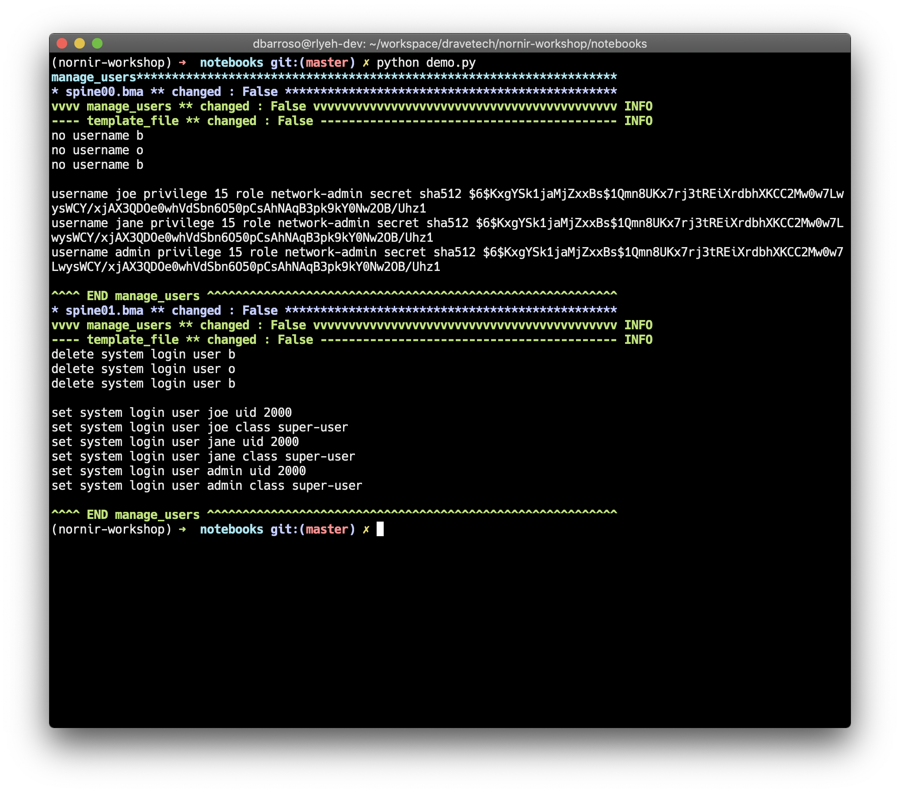
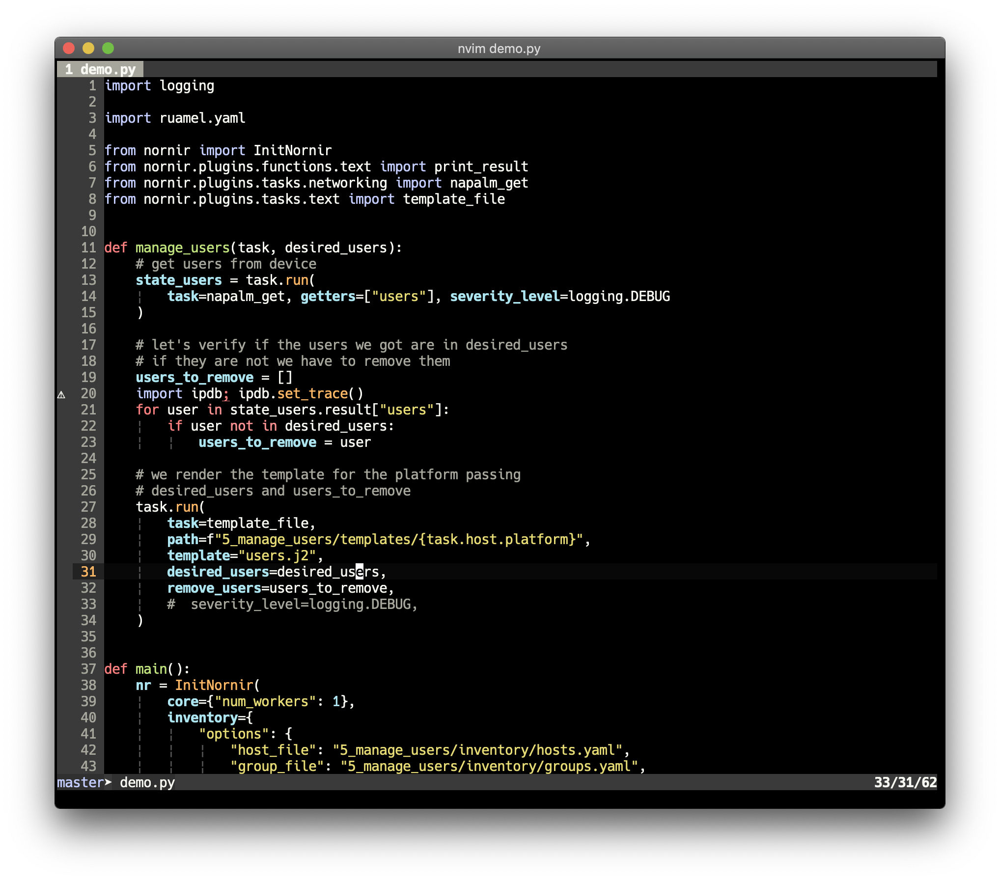
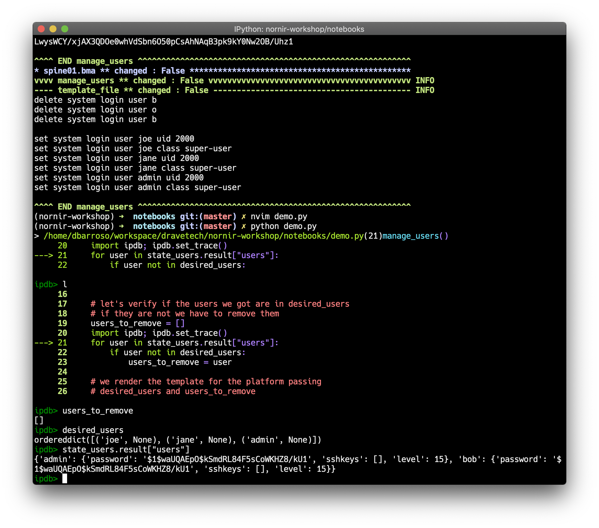
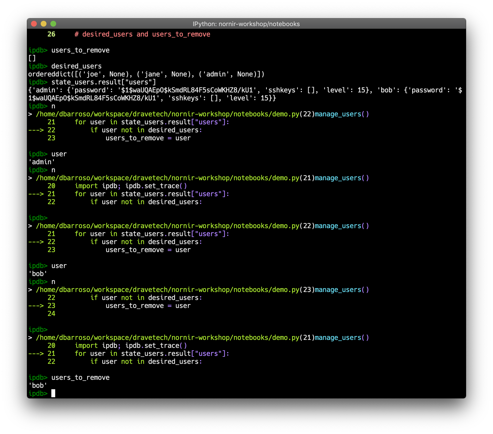
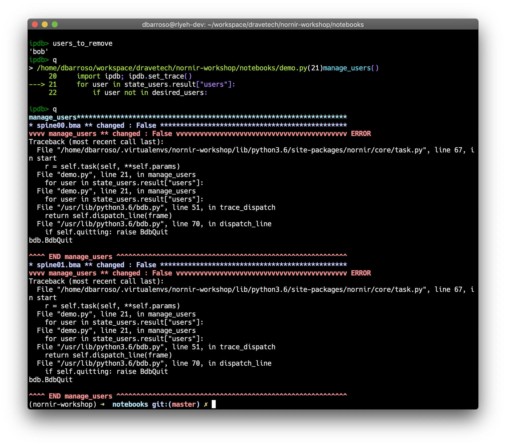
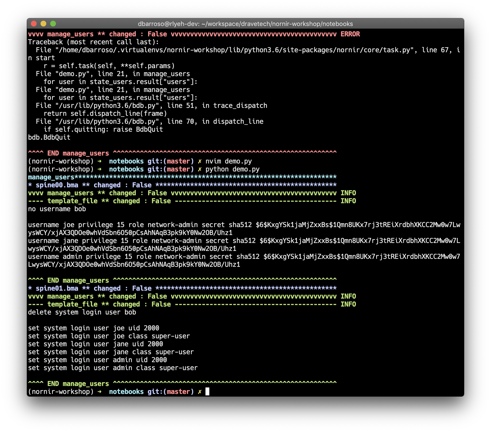

ipdb: How to use it with Nornir
===============================

Python comes with a debuger called pdb. The python debugger is very powerful and really facilitates troubleshooting code. You can find the official documentation `here <https://docs.python.org/3/library/pdb.html>`_. `ipdb <https://github.com/gotcha/ipdb>`_ builds on top of ipython and pdb to give users a more interactive experience.

This how to isn't very extensive, it's just a very quick and dirty demo to show some of it's capabilities and how to use it with nornir. It doesn't assume previous knowledge but doesn't spend too much on explanations either so it expects users to give enough material for further investigation.

Installing ipdb
---------------

First, you will need to install `ipython <http://ipython.org/>`_, follow the official guide to do so, then you will need to install ``ipdb``. You can install the latter via pip::

   pip install ipdb

Finding and fixing a bug with ipdb
----------------------------------

For the sake of the demo I have written some code that contains a bug. The code is not important but what it does is:

#. Read a yaml file containing a bunch of users we want to have configured on our devices
#. Connect to a couple of network devices and get the users configured
#. Check which users are already configured, which ones we want and compute two lists; a list with the users we need to configure and another list with the ones we need to remove.
#. Finally, we pass those lists to a template and we generate some configuration.

First, let's run the script:

Looks like the code is trying to remove 3 users; "b", "o" and "b". You probably figured that's not correct. In our devices we have a user "bob" that is not listed in our yaml file describing the users we want so we should be removing "bob". However, something went wrong and we are doing something different.

You can insert a tracepoint in several ways, for the sake of the demo we are going to do it directly in the so let's open up the code and insert a break point:

Notice the following lines:

- line 20: that's where we introduced the tracepoint.
- line 39: the python debugger doesn't interact well with threads so we need to disable parallelization by setting 1 worker

Now that we have the break point let's run the code again:

.. image:: ipdb_how_to_use_it_with_nornir/3.png

After running the script again we get a shell. We can also see a few lines of code to give us context and know where we are. In this shell you can execute python code and also pdb commands. Some of the pdb commands we are going to be using are:

- ``l`` (list) - prints the code around the current break point
- ``n`` (next) - executes the code in the current line
- ``c`` (continue) - executes normally until it finds another break point

Let's also print a few variables to see what we are dealing with:

In the capture above you can see we used ``l`` to show the code around current break point and then we printed some of the variables in it.

Now we can keep executing the code line by line with ``n`` and print the variables to see what's going on. A few things to note:

- we can see how the execution loops around in the for loop
- we can also see how the user "admin" doesn't meet the criteria in line 22 causing the code to loop back to line 21
- when we run the loop for user "bob", the condition in line 22 is met so we go to line 23

At this point we can print ``users_to_remove`` and realize we assigned a string even though we started by assigning an empty list to it. This would explain why "bob" turns into "b", "o", "b" (strings are iterables like lists). Let's exit ``ipdb``:

Now let's finally fix line 23, appending the user instead of assigning it to the variable should do the trick:

.. image:: ipdb_how_to_use_it_with_nornir/7.png

And now let's run the code again:

