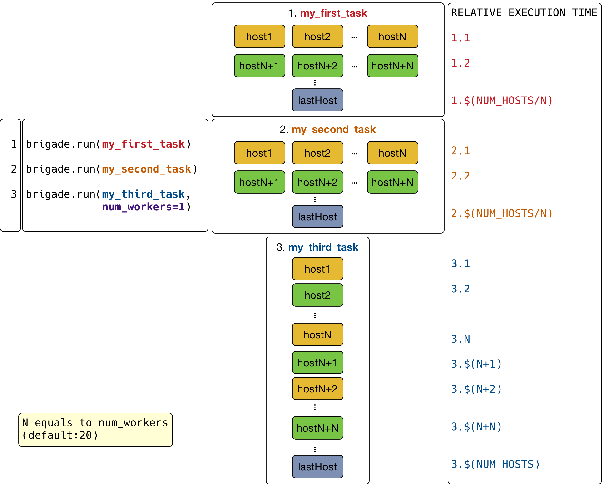
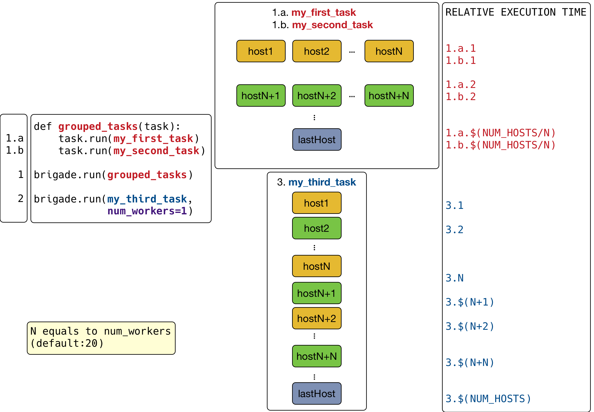

Execution Model
===============

Nornir delegates host concurrency to its configured runner. It includes three execution
modes:

* ``ThreadedRunner`` is the default. :obj:`nornir.core.Nornir.run` executes synchronous
  tasks in a thread pool, with at most ``num_workers`` hosts in flight. The default is
  20 workers; setting it to 1 serializes host execution while retaining the thread-pool
  runner.
* ``SerialRunner`` executes synchronous tasks for one host at a time in the caller's
  thread. This is useful for troubleshooting, stepping through tasks, or accessing a
  resource that must not be used concurrently.
* ``AsyncioRunner`` is opt-in. :obj:`nornir.core.Nornir.arun` executes native
  ``async def`` tasks on the caller's event loop, with at most ``num_workers`` hosts in
  flight. It does not create a thread per host. See the executed
  :doc:`../howto/asyncio_runner` notebook for a complete example.

Execution entry points are explicit. ``run()`` accepts synchronous tasks and ``arun()``
accepts coroutine tasks. Passing a coroutine task to ``run()`` is rejected with
``AsyncTaskOnSyncRunError`` instead of storing an un-awaited coroutine as a successful
result. Conversely, ``arun()`` rejects synchronous tasks, and requires a runner with an
asynchronous ``arun`` capability. Select the asyncio runner before using asynchronous
entry points.

Below you can see a simple diagram illustrating how this works:

Tasks can run other tasks. Nested tasks execute in order for that host while other hosts
continue concurrently. A synchronous parent uses ``Task.run`` for synchronous subtasks.
An asynchronous parent uses ``await Task.arun`` for coroutine subtasks, but may still use
``Task.run`` for short synchronous subtasks. Synchronous subtasks run inline and block the
event loop until they return.

This lets a workflow enforce dependencies without giving up concurrency between hosts.
For instance, it could:

1. Configure everything in parallel
2. Run some verification tests
3. Enable services

Processors receive the same lifecycle events in synchronous and asynchronous runs, but
processor hooks are synchronous. In an asyncio run they execute on the caller's event
loop and block all other tasks until the hook returns. Native asynchronous processor
hooks are outside the current execution contract and are tracked in `issue #1090
<https://github.com/nornir-automation/nornir/issues/1090>`_.

Connection execution capabilities are independent of runner selection. Legacy plugins
registered in ``ConnectionPluginRegister`` are synchronous only. Plugins registered in
``CapabilityConnectionPluginRegister`` declare ``sync``, ``asyncio``, or both and use
the matching host connection entry points. See
:doc:`../howto/writing_capability_connection_plugins` for registration and lifecycle
details.
