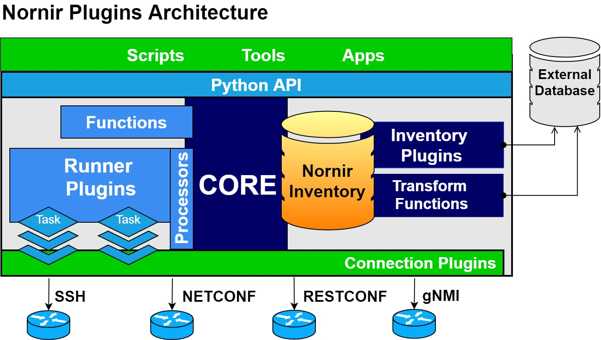

Plugins
=======

Nornir is a pluggable system and only very basic ones are included with nornir 3, for a list of third party plugins visit `nornir.tech <https://nornir.tech/nornir/plugins>`_

   
Registering plugins
-------------------

Starting with nornir3 some plugins need to be registered in order to be used. In particular:

* inventory plugins
* transform functions
* connection plugins
* runners

To do so you can use `entry points <https://setuptools.readthedocs.io/en/latest/setuptools.html#dynamic-discovery-of-services-and-plugins>`_ or programmatically.

Using entrypoints in your ``setup.py``::

  setup(
    # ...
    entry_points={
      "PATH": "NAME = path.to:Plugin",
    }
  )

In your pyproject.toml if using ``poetry``::

  [tool.poetry.plugins."PATH"]
  "NAME" = "path.to:Plugin"

Where PATH is:

* ``nornir.plugins.inventory`` - for inventory plugins
* ``nornir.plugins.transform_function`` - for transform functions
* ``nornir.plugins.runners`` - for runners
* ``nornir.plugins.connections`` - for connection plugins

Where NAME is the way you want to refer to it later on and ``path.to:Plugin`` the import path. For instance::

  [tool.poetry.plugins."nornir.plugins.inventory"]
  "inventory-name" = "path.to:InventoryPlugin"

To do it programmatically import the correct plugin register and use the ``register`` method. For instance::

  from nornir.core.plugins.inventory import InventoryPluginRegister

  from path.to import InventoryPlugin

  InventoryPluginRegister.register("inventory-name", InventoryPlugin)

Connections
-----------

A connection plugin is a nornir plugin that allows nornir to manage connections with devices

Inventory
---------

An inventory plugin is a nornir plugin that allows nornir to create an Inventory object from an external source

Included
________

.. automodule:: nornir.plugins.inventory.__init__
  :members:
  :undoc-members:

Transform functions
-------------------

A transform function is a plugin that manipulates the inventory independently from the inventory plugin used. Useful to extend data using the environment, a secret store or similar.

During inventory initialization, the transform function will be called in a for loop for each host. The transform function takes a host object as the first parameter and additional keyword arguments as specified in the `config.inventory.transform_function_options` dictionary.

Runners
_______

A runner is a plugin that dictates how to execute the tasks over the hosts

Included
________

.. automodule:: nornir.plugins.runners.__init__
  :members:
  :undoc-members:

For more details about ``ThreadedRunner`` read the :doc:`execution_model`.

Processors
----------

A processor is a plugin that taps into certain events and allows the user to execute arbitrary code on those events.
