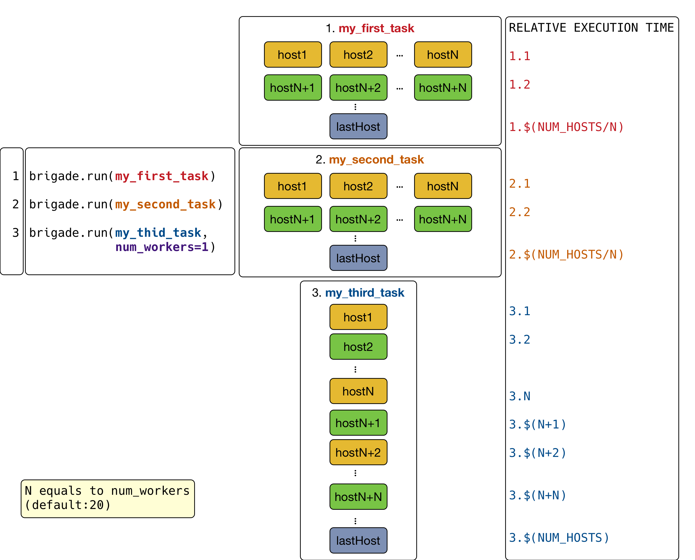
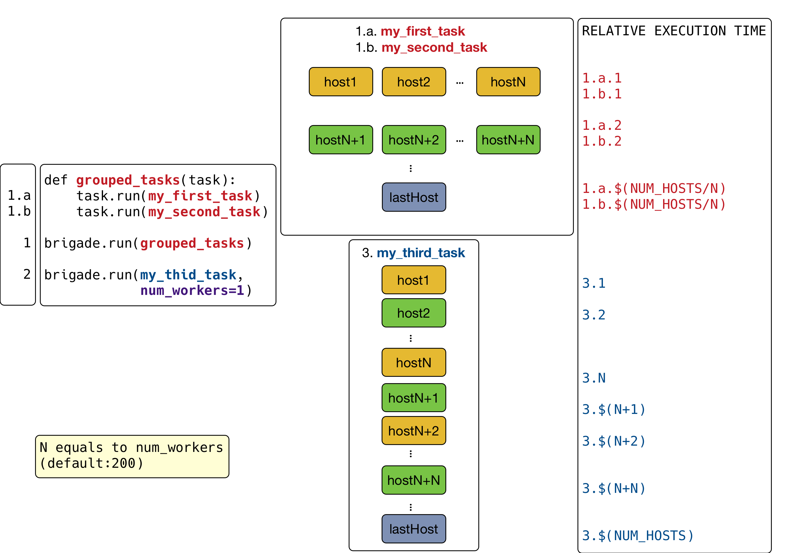

Execution Model
===============

One of the many advantages of using nornir is that it will be parallelize the execution of tasks for you. The way it works is as follows:

1. You trigger the parallelization by running a task via :obj:`nornir.core.Nornir.run` with ``num_workers > 1`` (defaults to ``20``).
2. If ``num_workers == 1`` we run the task over all hosts one after the other in a simple loop. This is useful for troubleshooting/debugging, for writing to disk/database or just for printing on screen.
3. When parallelizing tasks nornir will use a different thread for each host.

Below you can see a simple diagram illustrating how this works:

Note that you can create tasks with other tasks inside. When tasks are nested the inner tasks will run serially for that host in parallel to other hosts. This is useful as it let's you control the flow of the execution at your own will. For instance, you could compose a different workflow to the previous one as follows:

Why would you do this? Most of the time you will want to group as many tasks as possible. That will ensure your script runs as fast as possible. However, some tasks might require to be run after ensuring the some others are done. For instance, you could do something like:

1. Configure everything in parallel
2. Run some verification tests
3. Enable services
